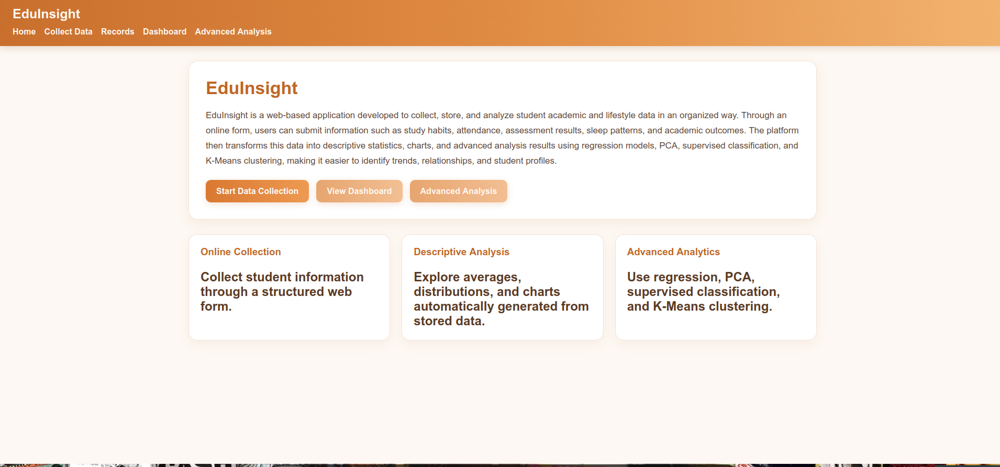
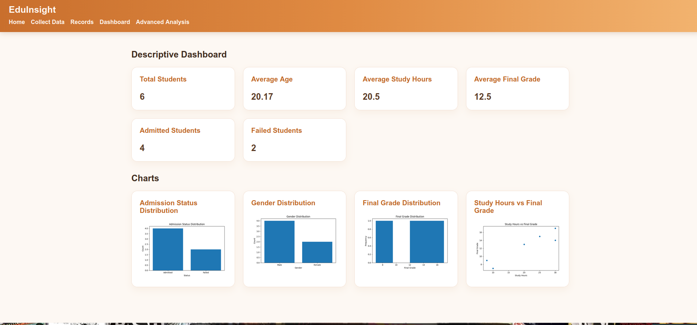
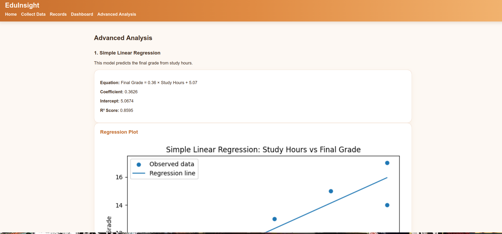
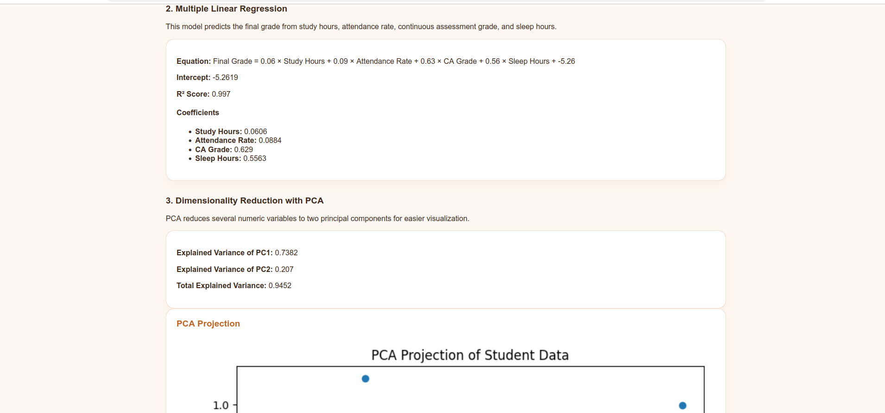
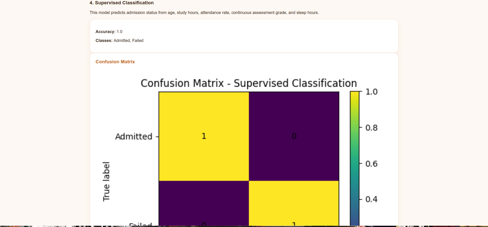
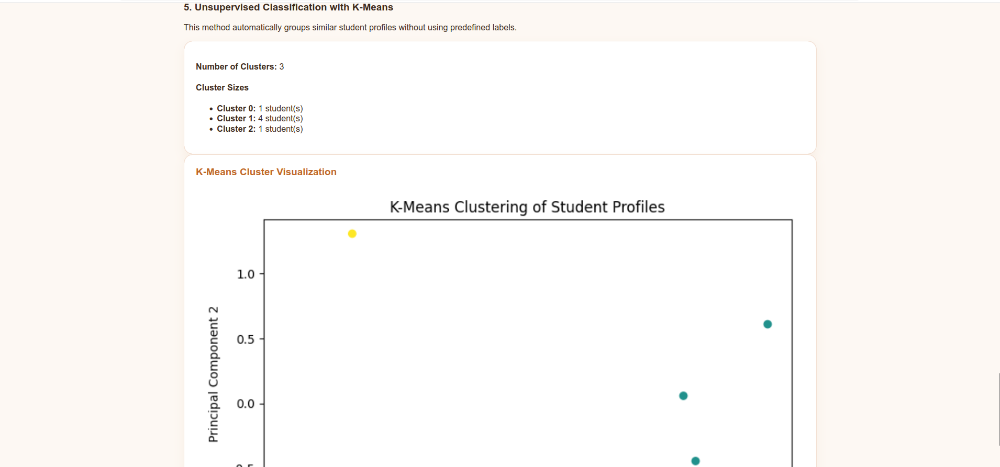

# EduInsight

EduInsight is a student data collection and analysis web app that I built as an individual project during my second year of Computer Science at the University of Yaoundé I.

The idea was to build a small application where student information could be collected, stored, and then analysed from the same interface. I used the project to practise Flask, databases, data visualisation, and some introductory machine learning techniques.

## What the app does

Users can enter information such as:

- age and gender
- department and level
- weekly study hours
- tutorial participation
- attendance rate
- continuous assessment grade
- sleep hours
- internet quality
- stress level
- final grade
- admission status

The application stores the records and makes them available from a records page.

It also includes a dashboard showing basic statistics such as the number of students, average age, average study hours, average final grade, and admission results.

The dashboard generates a few charts as well, including:

- admission status distribution
- gender distribution
- final grade distribution
- study hours vs final grade

## Advanced analysis

I also added an advanced analysis section to experiment with different data-analysis methods.

It currently includes:

- **Simple linear regression** to study the relationship between study hours and final grade
- **Multiple linear regression** using study hours, attendance rate, continuous assessment grade, and sleep hours
- **PCA** to reduce several numerical variables to two components for visualisation
- **Logistic regression classification** to predict admission status from student characteristics
- **K-Means clustering** to group similar student profiles without predefined labels

The graphs are generated with Matplotlib, while the analysis uses NumPy and scikit-learn.

## Technologies used

- Python
- Flask
- PostgreSQL
- SQLite
- HTML / CSS
- NumPy
- Matplotlib
- scikit-learn
- Git and GitHub

For the database, the app uses **SQLite when running locally** and switches to **PostgreSQL when a `DATABASE_URL` environment variable is available**. I originally used PostgreSQL when deploying the project on Render.

## Project structure

```text
EduInsight/
├── static/
│   └── style.css
├── templates/
│   ├── advanced_analysis.html
│   ├── base.html
│   ├── collect.html
│   ├── dashboard.html
│   ├── index.html
│   └── records.html
├── utils/
│   ├── analytics.py
│   └── database.py
├── app.py
├── requirements.txt
└── students.db
```

`database.py` handles the database connection and student records, while `analytics.py` contains the dashboard calculations, chart generation, regressions, PCA, classification, and clustering logic.

## Running the project locally

Clone the repository and move into the project folder:

```bash
git clone <https://github.com/Youmbi-chloe/EduInsight.git>
cd EduInsight
```

Create and activate a virtual environment:

```bash
python -m venv venv
source venv/bin/activate
```

On Windows:

```bash
venv\Scripts\activate
```

Install the dependencies:

```bash
pip install -r requirements.txt
```

Run the application:

```bash
python app.py
```

The app will use the local SQLite database automatically.

If a PostgreSQL connection is provided through the `DATABASE_URL` environment variable, it will use PostgreSQL instead.

## Screenshots

### Home page



### Dashboard



### Advanced analysis





### Classification





## Note

This is an academic learning project. The analysis and machine-learning results depend on the student records currently stored in the database, so they should not be treated as validated real-world predictions.

## Author

**Youmbi Chloe**  
Computer Science student — University of Yaoundé I
